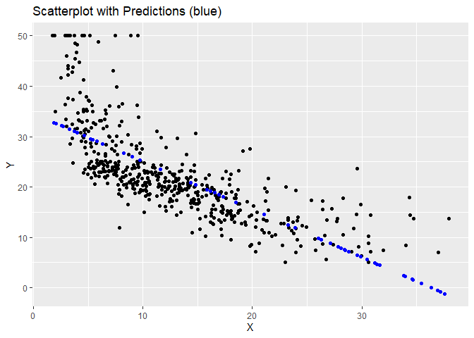

# Machine Learning Models from Scratch
Luke Andrade

## Packages and Data

``` r
library(tidyverse)
library(R6)
library(ISLR2)
df <- Boston
head(Boston)
```

         crim zn indus chas   nox    rm  age    dis rad tax ptratio lstat medv
    1 0.00632 18  2.31    0 0.538 6.575 65.2 4.0900   1 296    15.3  4.98 24.0
    2 0.02731  0  7.07    0 0.469 6.421 78.9 4.9671   2 242    17.8  9.14 21.6
    3 0.02729  0  7.07    0 0.469 7.185 61.1 4.9671   2 242    17.8  4.03 34.7
    4 0.03237  0  2.18    0 0.458 6.998 45.8 6.0622   3 222    18.7  2.94 33.4
    5 0.06905  0  2.18    0 0.458 7.147 54.2 6.0622   3 222    18.7  5.33 36.2
    6 0.02985  0  2.18    0 0.458 6.430 58.7 6.0622   3 222    18.7  5.21 28.7

## Simple Linear Regression

#### Creating a Simple Linear Regression Class

We will start by creating a class that has the values
,
,
"),
and
")

``` r
SLR <- R6Class('SLR',
               list(
                 y = vector(),
                 x = vector(),
                 initialize = function(y, x){
                   stopifnot(is.numeric(y), sum(is.na(y)) == 0)
                   stopifnot(is.numeric(x), sum(is.na(x)) == 0)
                   stopifnot(length(x) == length(y))
                                
                   self$y <- y
                   self$x <- x
                   }
                 ),
               lock_objects = F
               )
SLR
```

    <SLR> object generator
      Public:
        y: 
        x: 
        initialize: function (y, x) 
        clone: function (deep = FALSE) 
      Parent env: <environment: R_GlobalEnv>
      Locked objects: FALSE
      Locked class: FALSE
      Portable: TRUE

First we want to calculate the linear regression model coefficients. The
model will follow the form

where

}{var(X)}")


``` r
SLR$set('public', 'calc_coeffs',
        function(){
          self$y_bar <- mean(self$y)
          self$x_bar <- mean(self$x)
          self$b1 = cov(self$x, self$y) / var(self$x)
          self$b0 = self$y_bar - self$b1 * self$x_bar
          invisible(self)
        }
        )
```

Next we create a method to make predictions and add the residuals to the
object where residuals are

and

are the fitted values. We will also create a plot that includes the
training data and predicted points.

``` r
SLR$set('public', 'predict',
        function(new_data, plot = T){
          preds <- self$b0 + self$b1 * new_data
          
          if(plot == T){
            self$graph <- ggplot(mapping = aes(self$x, self$y)) +
              geom_point() +
              geom_point(aes(new_data, preds), color = 'blue') +
              labs(x = 'X', y = 'Y', title = 'Scatterplot with Predictions (blue)')
          }
          
          return(preds)
        })

SLR$set('public', 'calc_resids',
        function(){
          self$fitted <- self$predict(self$x, F)
          self$residuals <- self$y - self$fitted
          invisible(self)
        })
```

Next we want to calculate the following sum of squares

^2")

^2")


``` r
SLR$set('public', 'calc_ss',
        function(){
          self$ssx <- sum((self$x - self$x_bar)^2)
          self$ssy <- sum((self$y - self$y_bar)^2)
          self$sse <- sum(self$residuals^2)
          invisible(self)
        })
```

Next we want to create a table that shows all of our coefficients,
standard errors, t-statistics, and p-values.


``` r
SLR$set('public', 'create_coeff_table',
        function(){
          sigma <- sqrt(self$sse / (length(self$residuals) - 2))
          se_b0 <- sigma*sqrt(1 / length(self$residuals) + self$x_bar^2 / self$ssx)
          se_b1 <- sigma / sqrt(self$ssx)
          se_r <- sqrt(self$sse / (length(self$residuals) - 2))
          t_b0 <- self$b0 / se_b0
          t_b1 <- self$b1 / se_b1
          pval_b0 <- 1 - pt(abs(t_b0), length(self$residuals) - 2)
          pval_b1 <- 1 - pt(abs(t_b1), length(self$residuals) - 2)
          
          self$coeff_table <- data.frame(Parameter = c('Intercept', 'X Variable'),
                                         Coefficient = c(self$b0, self$b1),
                                         SE = c(se_b0, se_b1),
                                         t_stat = c(t_b0, t_b1),
                                         p_val = c(pval_b0, pval_b1))
          invisible(self)
        })
```

Next we will calculate the value
.


``` r
SLR$set('public', 'calc_r2',
        function(){
          self$r2 <- (self$ssy - self$sse) / self$ssy
          invisible(self)
        })
```

Now we want to print out all of the necessary information when the model
is viewed.

``` r
SLR$set('public', 'print',
        function(){
          cat('Model: \n')
          cat('  Coeff  Estimate  SE  t-stat  p-val \n')
          cat(' ', self$coeff_table[[1,1]], round(self$coeff_table[[1,2]],3), round(self$coeff_table[[1,3]],3), round(self$coeff_table[[1,4]],3), round(self$coeff_table[[1,5]],3), '\n')
          cat(' ', self$coeff_table[[2,1]], round(self$coeff_table[[2,2]],3), round(self$coeff_table[[2,3]],3), round(self$coeff_table[[2,4]],3), round(self$coeff_table[[2,5]],3), '\n')
          cat('\n R-squared: ', round(self$r2,4))
        })
```

#### Creating a Function to Create the Model

``` r
SimpleLinearRegression <- function(y, x){
  mod <- SLR$new(y, x)$calc_coeffs()$calc_resids()$calc_ss()$create_coeff_table()$calc_r2()
  return(mod)
}
```

Now we will test it against the lm() function using the Boston housing
dataset.

``` r
mod1 <- SimpleLinearRegression(df$medv, df$lstat)
mod1
```

    Model: 
      Coeff  Estimate  SE  t-stat  p-val 
      Intercept 34.554 0.563 61.415 0 
      X Variable -0.95 0.039 -24.528 0 

     R-squared:  0.5441

``` r
mod1.1 <- lm(medv ~ lstat, data = df)
summary(mod1.1)
```


    Call:
    lm(formula = medv ~ lstat, data = df)

    Residuals:
        Min      1Q  Median      3Q     Max 
    -15.168  -3.990  -1.318   2.034  24.500 

    Coefficients:
                Estimate Std. Error t value Pr(>|t|)    
    (Intercept) 34.55384    0.56263   61.41   <2e-16 ***
    lstat       -0.95005    0.03873  -24.53   <2e-16 ***
    ---
    Signif. codes:  0 '***' 0.001 '**' 0.01 '*' 0.05 '.' 0.1 ' ' 1

    Residual standard error: 6.216 on 504 degrees of freedom
    Multiple R-squared:  0.5441,    Adjusted R-squared:  0.5432 
    F-statistic: 601.6 on 1 and 504 DF,  p-value: < 2.2e-16

We can easily see that the results are the same so we have a success!

Let’s check if predictions work.

``` r
new_data <- runif(n = 50, min = min(df$lstat), max = max(df$lstat))
preds <- mod1$predict(new_data)
mod1$graph
```


